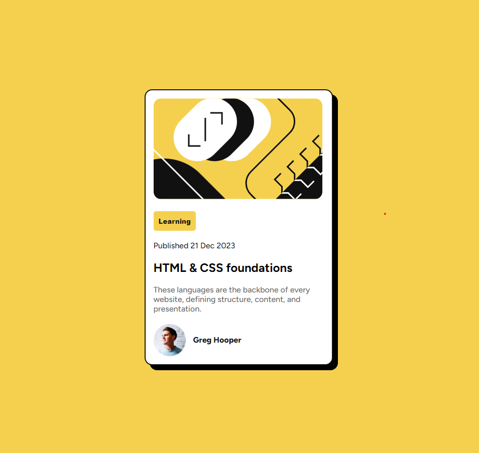

# Blog Preview Card

This is a solution to the [Frontend Mentor - Blog Preview Card](https://www.frontendmentor.io/challenges/blog-preview-card-component) challenge.

## 🔗 Live Site

👉 [View Live Site](https://ylmzhnf.github.io/frontend-mentor-learning/02-blog-preview-card/)

## 📌 About The Project

This project is a simple and clean blog preview card component built with HTML and CSS. It follows the design provided by Frontend Mentor and aims to improve layout and styling fundamentals.

## 🚀 Features

- Semantic HTML5 structure  
- CSS Flexbox for layout  
- Responsive design with media queries  
- Subtle hover effects and transitions  
- Custom Google Fonts (Figtree)

## 🎯 What I Learned

While building this project, I practiced:

- How to center content using `flexbox`
- How to use `box-shadow`, `border-radius`, and `hover` states
- Better understanding of CSS units and responsiveness

## 🖼️ Screenshot

## 🛠️ Built With

- HTML5
- CSS3
- Google Fonts ([Figtree](https://fonts.google.com/specimen/Figtree))
- Frontend Mentor design

---

## 📁 Folder Structure

blog-preview-card/
├── index.html
├── style.css
├── README.md
└── assets/
├── images/
├── illustration-article.svg
└── image-avatar.webp

## 📌 Status

✅ Completed – May 2025  
👨‍💻 Learning Project – Not for commercial use
