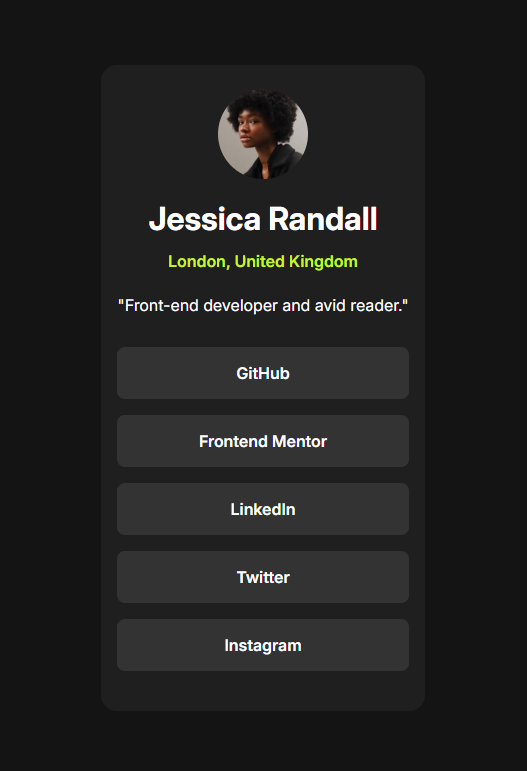
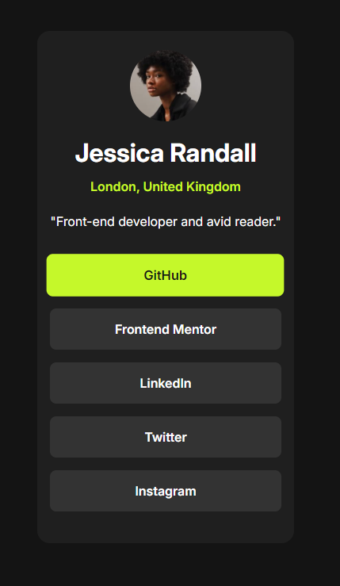

# 👤 Social Links Profile

This is a solution to the [Frontend Mentor - Social Links Profile challenge](https://www.frontendmentor.io/challenges/social-links-profile-UG32l9m6d).  
The goal of the challenge is to build a user profile card with social media links that matches a provided design as closely as possible.

---

## 🔗 Live Site

👉 [View Live Site](https://ylmzhnf.github.io/frontend-mentor-learning/03-social-links-profile-main/index.html)

---

## 📌 About the Project

The project is built with semantic HTML and CSS, using responsive design principles to ensure it looks great on both mobile and desktop devices.  
It includes:

- A profile image  
- Name and location  
- A short description  
- Social media links with hover effects  

---

## 🛠️ Built With

- HTML5  
- CSS3 (Flexbox & Media Queries)  
- Google Fonts (Inter)  
- Mobile-first responsive design

---

## 🎯 What I Learned

- How to structure HTML semantically for better accessibility  
- How to implement responsive layouts using Flexbox and media queries  
- How to add smooth hover effects using transitions and `transform: scale()`  
- The importance of clean file structure and class naming conventions

---

## 🖼️ Screenshots

  

---

## 📁 Folder Structure

social-links-profile-main/
├── index.html
├── style.css
├── README.md
└── assets/
└── images/
├── avatar-jessica.jpeg
├── favicon-32x32.png
├── social-links-screenshot.png
└── social-links-active-screenshot.png

---

## 📌 Project Status

👨‍💻 **Learning Project – Not intended for commercial use**

---