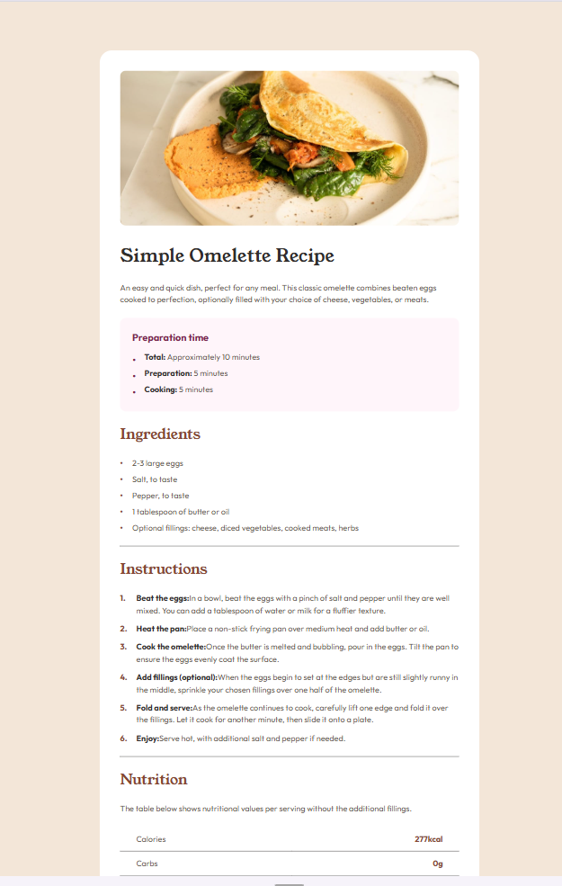

# Frontend Mentor - Recipe page solution

This is a solution to the [Recipe page challenge on Frontend Mentor](https://www.frontendmentor.io/challenges/recipe-page-KiTsR8QQKm). Frontend Mentor challenges help you improve your coding skills by building realistic projects. 

## Table of contents

- [Overview](#overview)
  - [The challenge](#the-challenge)
  - [Screenshot](#screenshot)
  - [Links](#links)
- [My process](#my-process)
  - [Built with](#built-with)
  - [What I learned](#what-i-learned)


## Overview

### Screenshot




### Links

- Solution URL: [View Project on GitHub](https://github.com/ylmzhnf/frontend-mentor-learning/tree/main/04-recipe-page-main)
- Live Site URL: [View Live Site](https://ylmzhnf.github.io/frontend-mentor-learning/04-recipe-page-main/)

## My process

  I approached this project using a mobile-first workflow. I focused on creating a clean, semantic HTML structure first, using appropriate classes for styling. I then applied CSS, utilizing custom properties for consistency, and implemented responsive design with media queries to transition smoothly to the desktop layout.

### Built with

- **Semantic HTML5 Markup:** Used `main`, `h1`, `h2`, `ul`, `ol`, and `table` for proper structure and accessibility.
- **CSS Custom Properties (Variables):** Defined all colors and fonts in the `:root` pseudo-class for easy management.
- **Mobile-first Workflow:** Designed the layout for small screens first, then scaled up to the desktop view using a `@media (min-width: 1440px)` query.
- **Flexbox:** Used for centering the main container on desktop.
- **Google Fonts:** Included Young Serif (for titles) and Outfit (for body text).


### What I learned

The biggest learning point in this project was customizing list styles to precisely match the design using advanced CSS techniques.

1.  **Customizing List Markers (`::before`):**
  Instead of relying on default markers, I removed them (`list-style: none;`) and used the `::before` pseudo-element with `position: absolute;` on list items to achieve the exact color and spacing for bullet points (for Ingredients) and numbered steps (for Instructions). This provides pixel-perfect control over list styling.

    ```css
  /* Example of custom bullet point styling */
  .ingredients-list li {
    list-style: none; 
    padding-left: 1.5rem;
    position: relative;
  }
  .ingredients-list li::before {
    content: "•";
    color: var(--color-brown-800);
    position: absolute;
    left: 0;
    top: 0;
  }
   ```
2.  **Table Styling for Nutritional Information:**
  
  I practiced styling the `<table>` element using `border-collapse: collapse;` and applying a bottom border to all rows except the last one. I also used distinct classes (`.name` and `.value`) to ensure the nutritional values are bold and the accent color (`var(--color-brown-800)`) is applied correctly.

  ```css
  .nutrition-table tr:last-child {
      border-bottom: none;
  }
  .nutrition-table .value {
     color: var(--color-brown-800);
     font-weight: 700;
     text-align: right;
  }
  ```

## Author

- Frontend Mentor - [@ylmzhnf](https://www.frontendmentor.io/profile/ylmzhnf)

