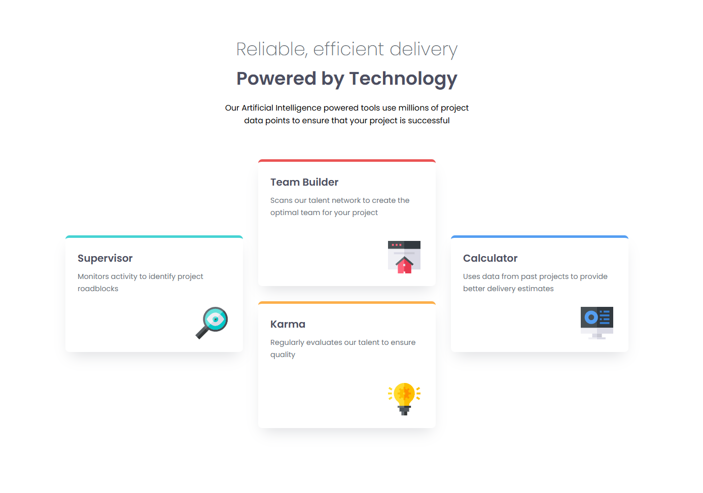

# Frontend Mentor - Four card feature section solution

This is a solution to the [Four card feature section challenge on Frontend Mentor](https://www.frontendmentor.io/challenges/four-card-feature-section-weK1eFYK). Frontend Mentor challenges help you improve your coding skills by building realistic projects. 

## Table of contents

- [Overview](#overview)
  - [The challenge](#the-challenge)
  - [Screenshot](#screenshot)
  - [Links](#links)
- [My process](#my-process)
  - [Built with](#built-with)
  - [What I learned](#what-i-learned)
- [Author](#author)

## Overview

### The challenge

This challenge helped me practice semantic HTML structure, CSS grid and responsive design principles while improving my CSS organization skills.

### Screenshot



### Links

- Solution URL: [View Project on GitHub](https://github.com/ylmzhnf/frontend-mentor-learning/tree/main/06-four-card-feature-section-master)
- Live Site URL: [View Live Site](https://ylmzhnf.github.io/frontend-mentor-learning/06-four-card-feature-section-master/)

## My process

### Built with

- Semantic HTML5 markup
- CSS custom properties
- Flexbox
- CSS Grid
- Mobile-first workflow

### What I learned

The main challenge was creating the asymmetrical desktop layout using **CSS Grid**. Key learnings included:

1.  **Vertical Spanning and Alignment:** Ensuring the side cards (`Supervisor` and `Calculator`) fully span the vertical space of the two central cards. This required using `grid-row: 1 / 3`, setting `.card { height: 100%; }`, and using `align-self: center` for perfect vertical centering.

2.  **Row Sizing:** Using `grid-template-rows: repeat(2, minmax(250px, auto))` on the container helped define consistent row height while allowing for content flexibility.

```css
/* Example of crucial Grid alignment */
.container {
    display: grid;
    /* ... row sizing here ... */
}
.supervisor {
    grid-row: 1 / 3;
    align-self: center; 
}
 ```

## Author

- Frontend Mentor - [@ylmzhnf](https://www.frontendmentor.io/profile/ylmzhnf)

