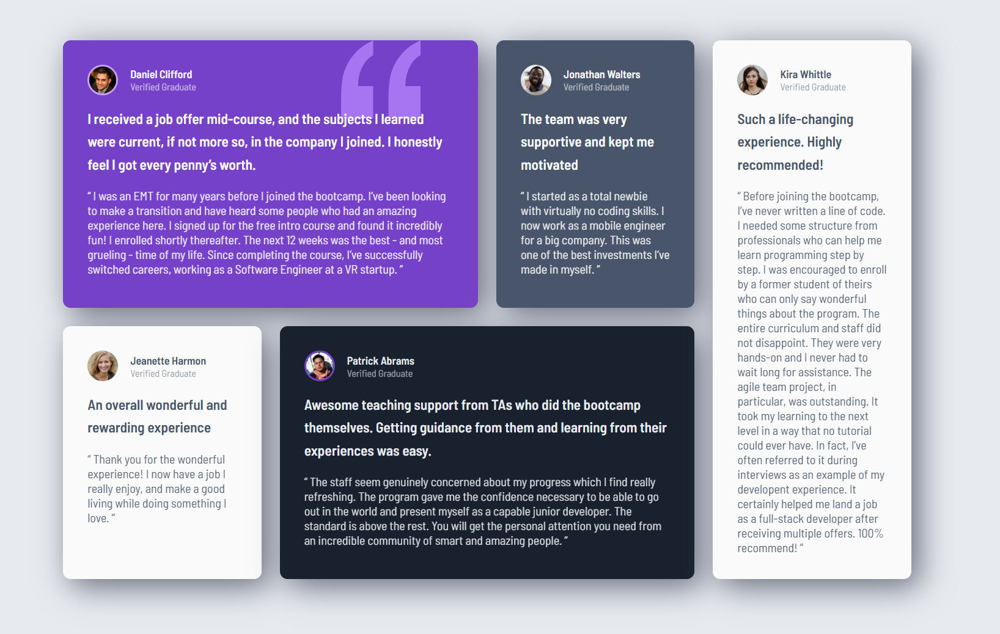

# Frontend Mentor - Testimonials grid section solution

This is a solution to the [Testimonials grid section challenge on Frontend Mentor](https://www.frontendmentor.io/challenges/testimonials-grid-section-Nnw6J7Un7). Frontend Mentor challenges help you improve your coding skills by building realistic projects. 

## Table of contents

- [Overview](#overview)
  - [Screenshot](#screenshot)
  - [Links](#links)
- [My process](#my-process)
  - [Built with](#built-with)
  - [What I learned](#what-i-learned)
- [Author](#author)


## Overview

### Screenshot



### Links

- Solution URL: [View Project on GitHub](https://github.com/ylmzhnf/frontend-mentor-learning/tree/main/07-testimonials-grid-section-main)
- Live Site URL: [View Live Site](https://ylmzhnf.github.io/frontend-mentor-learning/07-testimonials-grid-section-main/)

## My process

### Built with

- Semantic HTML5 markup
- CSS custom properties
- Flexbox
- CSS Grid
- Mobile-first workflow


### What I learned

In this project, I practiced creating complex layouts with CSS Grid, especially in the desktop view. I effectively used the grid-column and grid-row properties to position elements across multiple rows and columns within a four-column grid.

While following a mobile-first workflow, I also reinforced my understanding of semantic HTML structure, particularly how Flexbox containers like div.profile support responsive alignment.

One of the biggest takeaways was learning how to fine-tune padding and max-width to maintain a balanced layout while keeping the grid container perfectly centered.

```css
.testimonials-grid{
    grid-template-columns: repeat(4, 1fr);
    grid-auto-rows: auto;
}
```
## Author

- Frontend Mentor - [@ylmzhnf](https://www.frontendmentor.io/profile/ylmzhnf)

