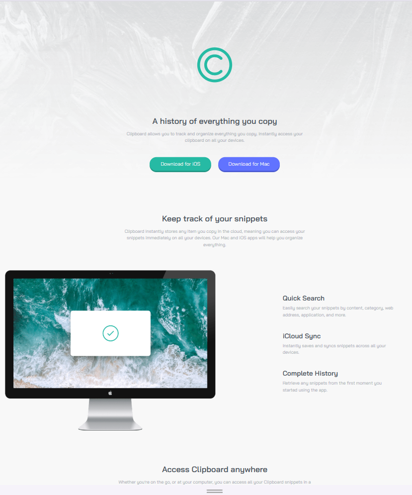

# Frontend Mentor - Clipboard landing page solution

This is a solution to the [Clipboard landing page challenge on Frontend Mentor](https://www.frontendmentor.io/challenges/clipboard-landing-page-5cc9bccd6c4c91111378ecb9). Frontend Mentor challenges help you improve your coding skills by building realistic projects. 

## Table of contents

- [Overview](#overview)
  - [The challenge](#the-challenge)
  - [Screenshot](#screenshot)
  - [Links](#links)
- [My process](#my-process)
  - [Built with](#built-with)
  - [What I learned](#what-i-learned)
- [Author](#author)

## Overview

### The challenge

Users should be able to:

- View the optimal layout for the site depending on their device's screen size
- See hover states for all interactive elements on the page

### Screenshot

### Links

- Solution URL: [View Project on GitHub](https://github.com/ylmzhnf/frontend-mentor-learning/tree/main/08-clipboard-landing-page-master)
- Live Site URL: [View Live Site](https://ylmzhnf.github.io/frontend-mentor-learning/08-clipboard-landing-page-master/)

## My process

### Built with

- Semantic HTML5 markup
- CSS custom properties
- Flexbox
- CSS Grid
- Mobile-first workflow

### What I learned

While using semantic HTML, I tried to stay faithful to the design and created a clear class structure. I used Flexbox for the mobile layout and a combination of CSS Grid and Flexbox for the desktop layout. Adjusting the layout and spacing with margins and padding repeatedly was the most challenging part for me.

Technical Details:

- Used Flexbox for mobile and CSS Grid for desktop to create a responsive and consistent layout.

- Implemented CSS custom properties for colors, fonts, and spacing (e.g., --green-500: hsl(171, 66%, 44%);).

- Followed a mobile-first approach, designing for mobile first and adding desktop adjustments with media queries.

- Managed hover, focus, and active states in CSS to improve user interaction.

- Optimized backgrounds and images for responsive display (background-size: contain;).

- Ensured consistent component spacing and typography across different screen sizes.

## Author

- Frontend Mentor - [@ylmzhnf](https://www.frontendmentor.io/profile/ylmzhnf)