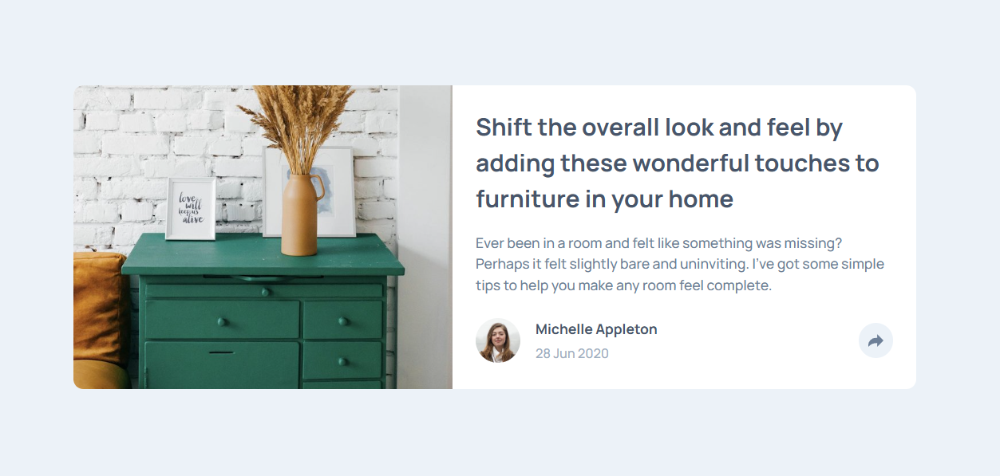

# Frontend Mentor - Article preview component solution

This is a solution to the [Article preview component challenge on Frontend Mentor](https://www.frontendmentor.io/challenges/article-preview-component-dYBN_pYFT). Frontend Mentor challenges help you improve your coding skills by building realistic projects. 

## Table of contents

- [Overview](#overview)
  - [The challenge](#the-challenge)
  - [Screenshot](#screenshot)
  - [Links](#links)
- [My process](#my-process)
  - [Built with](#built-with)
  - [What I learned](#what-i-learned)
- [Author](#author)


## Overview

### The challenge

Users should be able to:

- View the optimal layout for the component depending on their device's screen size
- See the social media share links when they click the share icon

### Screenshot




### Links

- Solution URL: [View Project on GitHub](https://github.com/ylmzhnf/frontend-mentor-learning/tree/main/09-article-preview-component-master)
- Live Site URL: [View Live Site](https://ylmzhnf.github.io/frontend-mentor-learning/09-article-preview-component-master/)

## My process

### Built with

- Semantic HTML5 markup
- CSS custom properties
- Flexbox
- JavaScript (DOM manipulation)
- Mobile-first workflow


### What I learned

During this project, I focused on:

- Implementing the share button using JavaScript DOM manipulation

- Creating a tooltip for the desktop version, which was the most challenging part

- Maintaining semantic HTML for better accessibility and structure

- Practicing responsive design and layout alignment with Flexbox

Example of JavaScript logic for the share button:

```js
const shareButton = document.querySelector(".share-btn");
const tooltip = document.querySelector(".active-share-btn");

shareButton.addEventListener("click", () => {
  tooltip.classList.toggle("display");
});

```
## Author

- Frontend Mentor - [@ylmzhnf](https://www.frontendmentor.io/profile/ylmzhnf)
